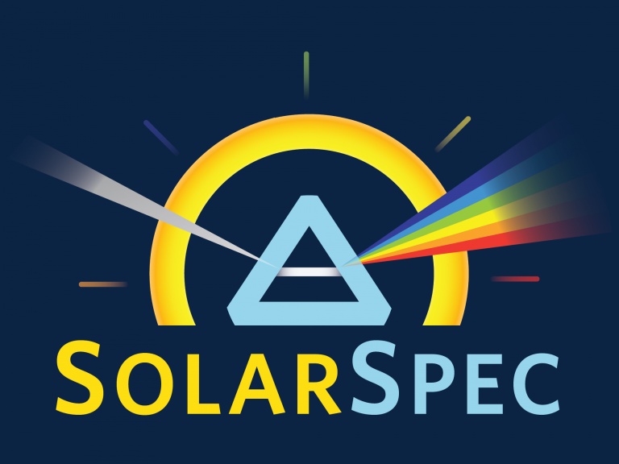

<div id="top"></div>

<!-- PROJECT SHIELDS -->
[![Contributors][contributors-shield]][contributors-url]
[![Forks][forks-shield]][forks-url]
[![Stargazers][stars-shield]][stars-url]
[![Issues][issues-shield]][issues-url]
[![MIT License][license-shield]][license-url]
[![LinkedIn][linkedin-shield]][linkedin-url]


<!-- PROJECT LOGO -->
<br />
<div align="center">
  <a href="https://github.com/SolarSpec/TRPL_Photos">
    
  </a>

<h3 align="center">TRPL Fitting Tool</h3>

  <p align="center">
    A MATLAB application for Time-Resolved Photoluminescence (TRPL) data analysis and fitting
    <br />
    <a href="https://github.com/SolarSpec/TRPL_Photos"><strong>Explore the docs »</strong></a>
    <br />
    <br />
    <a href="https://github.com/SolarSpec/TRPL_Photos">View Demo</a>
    ·
    <a href="https://github.com/SolarSpec/TRPL_Photos/issues">Report Bug</a>
    ·
    <a href="https://github.com/SolarSpec/TRPL_Photos/issues">Request Feature</a>
  </p>
</div>


<!-- TABLE OF CONTENTS -->
<details>
  <summary>Table of Contents</summary>
  <ol>
    <li>
      <a href="#about-the-project">About The Project</a>
      <ul>
        <li><a href="#built-with">Built With</a></li>
      </ul>
    </li>
    <li>
      <a href="#getting-started">Getting Started</a>
      <ul>
        <li><a href="#prerequisites">Prerequisites</a></li>
        <li><a href="#installation">Installation</a></li>
      </ul>
    </li>
    <li><a href="#usage">Usage</a></li>
    <li><a href="#roadmap">Roadmap</a></li>
    <li><a href="#contributing">Contributing</a></li>
    <li><a href="#license">License</a></li>
    <li><a href="#contact">Contact</a></li>
    <li><a href="#acknowledgments">Acknowledgments</a></li>
  </ol>
</details>


<!-- ABOUT THE PROJECT -->
# About The Project


This MATLAB application streamlines the process of analyzing Time-Resolved Photoluminescence (TRPL) data by providing a comprehensive tool for:
- Loading instrument response (IRF) and decay data
- Selecting fitting parameters
- Running multi-start deconvolution fits against various kinetic models
- Visualizing results
- Exporting both plots and numerical outputs

<p align="right">(<a href="#top">back to top</a>)</p>


### Built With

* [MATLAB](https://www.mathworks.com/products/matlab.html)
* [Parallel Computing Toolbox](https://www.mathworks.com/products/parallel-computing.html)
* [Optimization Toolbox](https://www.mathworks.com/products/optimization.html)
<!-- * [Image Processing Toolbox](https://www.mathworks.com/help/images/)
* [Curve Fitting Toolbox](https://www.mathworks.com/help/curvefit/) -->

<p align="right">(<a href="#top">back to top</a>)</p>


<!-- GETTING STARTED -->
# Getting Started

To begin using this app, follow these simple steps to ensure you have the necessary prerequisites and proper installation.

### Prerequisites

1. MATLAB (R2020b or newer recommended)
2. Required MATLAB Toolboxes:
   - Parallel Computing Toolbox
   - Optimization Toolbox
   - Statistics and Machine Learning Toolbox

### Installation

1. Clone the repository
   ```sh
   git clone https://github.com/SolarSpec/TRPL_Photos.git
   ```

2. Install the application in MATLAB
   ```
   Double-click the app1.mlappinstall file in the repository
   ```

3. Access the app
   ```
   Navigate to the APPS tab in MATLAB
   Find the app under 'MY APPS'
   Add it to your favorites for quick access
   ```

<p align="right">(<a href="#top">back to top</a>)</p>


<!-- USAGE EXAMPLES -->
## Usage

### Basic Workflow

1. **Load IRF Data**
   - Click "Load IRF Data"
   - Select an Excel file with time (ns) in first column and IRF amplitude in second column
   - The IRF curve will be plotted in the top axes

2. **Load Decay Data**
   - Must load IRF first
   - Click "Load Decay Data"
   - Select similarly formatted Excel file
   - The app will interpolate to match IRF's time axis if needed
   - Raw TRPL decay will be plotted in bottom axes

3. **Set Fit Parameters**
   - Conv Pad: Points to pad each side when convolving (default: 15)
   - Window Lower/Upper Bound: Time window for fitting (default: 48-80 ns)
   - Window Baseline Start/End: Indices for baseline estimation (default: 900-1100)

4. **Perform the Fit**
   - Click "Fit"
   - Select kinetic model from dialog (e.g., one exponential, two exponentials, power law)
   - The app will:
     - Spawn parallel pool
     - Trim trailing zeros
     - Extract fit window ± padding
     - Build constrained optimization problem
     - Run MultiStart with 50 starts to minimize χ²
     - Display fit and residual plots with legends and metrics

5. **Export Results**
   - Use "Export TRPL Decay" and "Export Residuals" for vector plots (.emf for Windows, .pdf for Mac)
   - "Export Data" saves a .mat file containing:
     - Raw time data
     - IRF data
     - Decay data
     - Chosen parameters
     - Fit outputs (parameters, function values, ChiSq, RedChiSq)

### Advanced Features

- **Model Selection**: Choose from various kinetic models including:
  - Single exponential
  - Double exponential
  - Power law
  - Mixed models

- **Optimization**: The app uses MultiStart with fmincon for robust global optimization

- **Visualization**: 
  - Log-scale plots of data vs. total fit
  - Individual component visualization
  - Residual analysis
  - Baseline correction

<p align="right">(<a href="#top">back to top</a>)</p>

<!-- ROADMAP -->
## Roadmap

* [X] Load and process IRF data
* [X] Load and process decay data
* [X] Implement multiple kinetic models
* [X] Add parallel processing support
* [X] Export functionality for plots and data
* [ ] Add error bar support
* [ ] Implement batch processing
* [ ] Add more kinetic models
* [ ] Improve visualization options

See the [open issues](https://github.com/SolarSpec/TRPL_Photos/issues) for a full list of proposed features and known issues.

<p align="right">(<a href="#top">back to top</a>)</p>

<!-- CONTRIBUTING -->
## Contributing

Contributions are what make the open source community such an amazing place to learn, inspire, and create. Any contributions you make are **greatly appreciated**.

If you have a suggestion that would make this better, please fork the repo and create a pull request. You can also simply open an issue with the tag "enhancement".
Don't forget to give the project a star! Thanks again!

1. Fork the Project
2. Create your Feature Branch (`git checkout -b feature/AmazingFeature`)
3. Commit your Changes (`git commit -m 'Add some AmazingFeature'`)
4. Push to the Branch (`git push origin feature/AmazingFeature`)
5. Open a Pull Request

<p align="right">(<a href="#top">back to top</a>)</p>

<!-- LICENSE -->
## License

Distributed under the BSD 3-Clause License. See `LICENSE.txt` for more information.

Please refer to the TDMS reader directory to view the accompanying [`license.txt`](https://github.com/SolarSpec/ScriptsAndFunctions/blob/main/Matlab%20TDMS%20reader/license.txt)

<p align="right">(<a href="#top">back to top</a>)</p>

<!-- CONTACT -->
## Contact

SolarSpec - [SolarSpec Website](https://solarspec.ok.ubc.ca/) - rsarke01@student.ubc.ca

Project Link: [https://github.com/SolarSpec/ScriptsAndFunctions](https://github.com/SolarSpec/ScriptsAndFunctions)

<p align="right">(<a href="#top">back to top</a>)</p>

<!-- ACKNOWLEDGMENTS -->
## Acknowledgments

* [Group Leader - Dr. Robert Godin](https://solarspec.ok.ubc.ca/people/)
* [The Entire SolarSpec Team](https://solarspec.ok.ubc.ca/people/)

<p align="right">(<a href="#top">back to top</a>)</p>

<!-- MARKDOWN LINKS & IMAGES -->
<!-- https://www.markdownguide.org/basic-syntax/#reference-style-links -->
[contributors-shield]: https://img.shields.io/github/contributors/SolarSpec/TRPL_Photos.svg?style=for-the-badge
[contributors-url]: https://github.com/SolarSpec/TRPL_Photos/graphs/contributors
[forks-shield]: https://img.shields.io/github/forks/SolarSpec/TRPL_Photos.svg?style=for-the-badge
[forks-url]: https://github.com/SolarSpec/TRPL_Photos/network/members
[stars-shield]: https://img.shields.io/github/stars/SolarSpec/TRPL_Photos.svg?style=for-the-badge
[stars-url]: https://github.com/SolarSpec/TRPL_Photos/stargazers
[issues-shield]: https://img.shields.io/github/issues/SolarSpec/TRPL_Photos.svg?style=for-the-badge
[issues-url]: https://github.com/SolarSpec/TRPL_Photos/issues
[license-shield]: https://img.shields.io/github/license/SolarSpec/TRPL_Photos.svg?style=for-the-badge
[license-url]: https://github.com/SolarSpec/TRPL_Photos/blob/main/LICENSE
[linkedin-shield]: https://img.shields.io/badge/-LinkedIn-black.svg?style=for-the-badge&logo=linkedin&colorB=555
[linkedin-url]: https://www.linkedin.com/in/raad-sarker-37935a286/
[product-screenshot]: TRPL_Photos/screenshot.png
